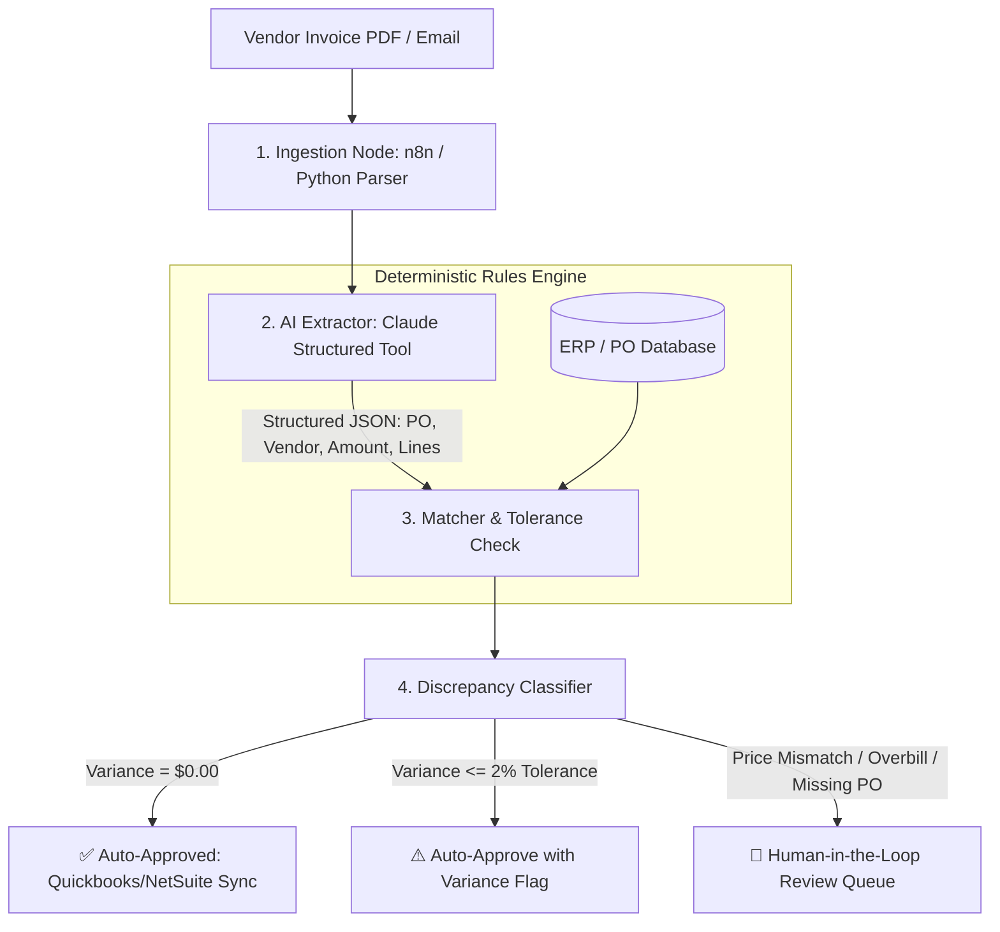

# 🧾 Invoice Reconciliation Agent — Operational Playbook
PLAYBOOK.md — Production Implementation & Standard Operating Procedures

This playbook outlines the operational procedures, threshold rules, discrepancy escalation pathways, and implementation guide for the **Invoice Reconciliation Agent**.

---

## 1. 💼 Executive Overview & Business Case

### The Problem
Accounts Payable (AP) teams spend **15–25 hours per week** manually cross-referencing vendor PDF invoices against Purchase Orders (POs) in ERP/accounting systems. Manual reconciliation suffers from human error, missed overbilling, and delayed supplier payments.

### The Automated Solution
An event-driven reconciliation agent combining **n8n orchestration**, **Claude structured extraction**, and a **deterministic Python reconciliation engine**. It extracts invoice line items, compares them against the PO database, calculates tolerances, and categorizes discrepancies into clear action classes.

### Quantified ROI & Value
* **Cycle Time**: Reduces invoice reconciliation from **12 minutes per invoice to < 4 seconds**.
* **Error Reduction**: Eliminates accidental payments on unauthorized quantities, price creep, and expired POs.
* **Cost Savings**: Saves ~$35,000 annually in AP administrative labor per 1,000 monthly invoices.

---

## 2. 🏗️ System Architecture & Agent Handoffs

### Input / Output Contracts
* **Input**: PDF/Text Invoice + PO Database CSV/API.
* **Extraction Schema**: `InvoicePayload` (Invoice #, PO #, Vendor Name, Total Amount, Line Items).
* **Reconciliation Output**: `ReconciliationResult` (`status`: `MATCHED` | `DISCREPANCY` | `MISSING_PO`, `discrepancy_type`, `variance_usd`, `action_required`).

---

## 3. 📋 Standard Operating Procedures (SOP)

### SOP-01: Ingesting a New Vendor Invoice
1. **Intake**: Incoming invoice PDF is deposited into monitored mailbox, S3 bucket, or local `data/sample_invoices/` directory.
2. **Extraction**: Parser extracts text and invokes Claude extraction prompt.
3. **PO Lookup**: System queries PO database (`data/purchase_orders.csv` or ERP API) using extracted `po_number`.

### SOP-02: Tolerance & Variance Evaluation
* **Exact Match (`MATCHED`)**: If line quantities and unit prices match within **$0.00 tolerance**, status is marked `MATCHED`.
* **Price Variance (`PRICE_MISMATCH`)**: If unit price differs from PO, calculate variance:
  $$\Delta = \text{Invoice Total} - \text{PO Expected Total}$$
* **Quantity Variance (`QUANTITY_MISMATCH`)**: If billed quantity exceeds ordered quantity without authorized change order.
* **Missing Reference (`MISSING_PO`)**: If `po_number` is absent or not found in ERP records.

---

## 4. 🛡️ Guardrails, Security & Anti-Hallucination

* **Deterministic Rules Layer**: Claude extracts numbers, but **never decides approval**. The Python math engine calculates all dollar differences to guarantee 100% mathematical precision.
* **Audit Logging**: Every execution logs raw input, extracted JSON, PO comparison values, and timestamp to `audit_logs/`.
* **Zero PII Exposure**: Vendor bank details and SSNs are scrubbed before prompt execution.

---

## 5. 🚨 Human-in-the-Loop (HITL) & Escalation Protocols

| Discrepancy Type | Automated Action | Human Reviewer Action |
| :--- | :--- | :--- |
| **Exact Match ($0.00)** | Auto-schedule payment in ERP | None (Zero-touch AP) |
| **Price Creep (< 2%)** | Flag for monthly vendor review | Approver clicks "Approve Variance" |
| **Overbilling (> 2%)** | Block payment & draft vendor dispute email | AP Specialist reviews and sends dispute |
| **Missing PO Number** | Route to Purchasing Department | Buyer attaches valid PO or rejects invoice |
| **Duplicate Invoice** | Hard reject and quarantine | Auditor reviews potential fraud |

---

## 6. 🚀 Deployment & Operational Checklist

- [ ] **Prerequisites**: Python 3.10+ and Anthropic API Key (or offline mode).
- [ ] **Environment Setup**: Copy `.env.example` to `.env` and configure `ANTHROPIC_API_KEY`.
- [ ] **PO Database Connection**: Ensure `data/purchase_orders.csv` or ERP webhook is connected.
- [ ] **Automated Test Run**: Run `pytest tests/` to verify 100% test coverage.
- [ ] **Trigger Execution**: Run `py agent.py` to reconcile all pending invoices.

---

## 7. 💬 Stakeholder & Client FAQ

**Q: Can the AI accidentally pay an incorrect invoice amount?**  
*A: No. The AI only performs reading and data extraction. Payment approval is governed by strict deterministic Python code with hard financial rules.*

**Q: What happens if an invoice is blurry or handwritten?**  
*A: If extraction confidence falls below 90% or required fields are unreadable, the invoice is automatically flagged for Human-in-the-Loop manual verification.*

**Q: How are ERP systems updated?**  
*A: Validated results trigger n8n webhooks or direct REST APIs to sync directly with QuickBooks, NetSuite, SAP, or Xero.*
