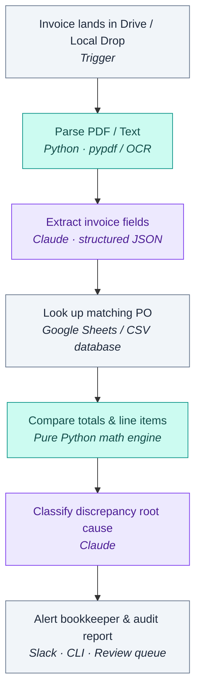

# Invoice Reconciliation Agent 🧾

An AI agent that reconciles supplier invoices against purchase orders and flags the discrepancies a human needs to look at — built on n8n, Claude, and pure Python.

When an invoice PDF lands in a watched folder, the agent reads it, finds the matching purchase order, checks the numbers, decides whether anything is off and *why*, and posts an alert to the people who handle exceptions. It replaces an afternoon of manual cross-checking with a pipeline that runs on every invoice automatically.

---

## 🏗️ Architecture



---

## 💡 The Core Design Principle

> **"The LLM does the language work; code does the math."**

Reading an unpredictable invoice layout into structured data and classifying an ambiguous mismatch are language tasks — that's where Claude excels. But determining whether a line item is an overcharge is an arithmetic calculation that must be **100% deterministic, transparent, and defensible** to a vendor or an auditor.

---

## 📂 Repository Contents

```
Invoice-Reconciliation-Agent/
├── invoice-reconciliation-agent.json   # Fully wired n8n workflow template
├── agent.py                            # Standalone Python CLI runner
├── test_agent.py                       # Automated test suite
├── requirements.txt                    # Python dependencies
├── .env.example                        # Configuration template
├── services/
│   ├── parser.py                       # PDF and text extraction service
│   ├── extractor.py                    # Claude structured invoice extraction
│   ├── reconciler.py                   # Pure Python arithmetic & tolerance math
│   └── classifier.py                   # Claude discrepancy root-cause classifier
├── data/
│   ├── purchase_orders.csv             # Sample PO database
│   └── sample_invoices/                # Test invoice fixtures
│       ├── invoice_101_perfect_match.txt
│       ├── invoice_102_price_mismatch.txt
│       ├── invoice_103_quantity_mismatch.txt
│       └── invoice_104_missing_po.txt
└── README.md
```

---

## 🚀 Running Locally (Standalone Python Agent)

You can run and test reconciliations right in your terminal without deploying cloud services:

### 1. Install dependencies
```bash
pip install -r requirements.txt
```

### 2. Configure environment (Optional for Claude calls)
Copy `.env.example` to `.env` and set your Anthropic API key:
```env
ANTHROPIC_API_KEY=sk-ant-your-key-here
ANTHROPIC_MODEL=claude-3-7-sonnet-20250219
```

### 3. Run a reconciliation
```bash
py agent.py data/sample_invoices/invoice_101_perfect_match.txt
```

### 4. Run the automated test suite
```bash
py test_agent.py
```

---

## ☁️ Running in n8n

1. Open n8n (**Workflows ➔ ⋯ ➔ Import from File**).
2. Select `invoice-reconciliation-agent.json`.
3. Add your credentials for Google Drive, Google Sheets, Anthropic, and Slack in the node settings.
4. Test with your watched invoices folder.


---

## 📄 License

This project is licensed under the [MIT License](LICENSE).
